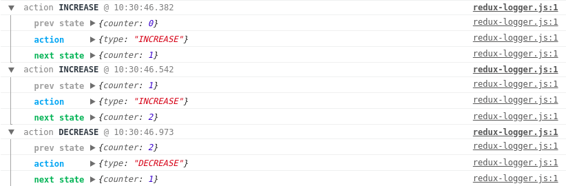

# What is Redux?

Everything you change in your application, included data and UI changes is contained in an object called `state`, so
basicaly Redux is a store which contains application state.

## State 

`State` is read only.
When you want to modify the state,
you need to `dispatch` an `action`.

## Action

`Action` is a plain javascript object, described in the simple way, includes an informations about changes in the application.
Action minimum requirement is a `TYPE` property. Actions could receive some arguments. Actions in redux have to be pure!

## Reducer

The state mutations in your app need to be pure functions.
Reducer receive initial state, previos state and action, then state don't modify the previous state, just return a new object.

## Store

`Store` has a current application `state` object and let you `dispatch actions`.
During creating a store, you need to provide a `reducer` as a parameter to let the store know what and how you want to update.

### Store methods:
`getState` - return current state
`dispatch` - let you dispatch actions
`subscribe` - let you subscribe on store changes and register a callback

Store shouldn't be mutated!
You should always return a new object.
To avoild an Object mutations, you can use those methods:

- spread operator:
```js
return {
  ...state,
  counter: state.counter + 1
};
```

- Object assign:

```js
return Object.assign({}, state, {
	counter: state.counter++
}
```

# Let's do it in practice!

## React installation

For this article I used `createReactApp` starter.

If you want to use it, please go to https://github.com/facebook/create-react-app,
then following `createReactApp` manual, you should be able to use those commands:

```
npx create-react-app my-app
cd my-app
npm start
```

Congratulations! Your React application is running.

Now we want to install Redux

## Redux installation

```
npm i react-redux redux --save-dev.
```

Redux is installed, so we can try to create our Redux store.
Please open react app folder in your IDE, go to `src`.
For this course I removed unnecessary files.
You can also remove all from `src` besides index.js.

## Create our first Redux Store

Go to ```index.js```
First of all, we need to import `createStore` method

```js
import { createStore } from 'redux';
```

To create a store, you need to call `createStore` method, passing reducer as an argument

```js
const store = createStore(reducer);
```

Now we need a `reducer`.
In this case it is a simple counter reducer

```js
const reducer = (state = initialState, action) => {
  switch (action.type) {
    case 'INCREASE':
      return {
        ...state,
        counter: state.counter + 1
      };
    case 'DECREASE':
      return {
        ...state,
        counter: state.counter - 1
      };
    default:
      return state;
  }
}
```

As you can see, our reducer is using `initialState`.
We can define it

```js
const initialState = {
  counter: 0
}
```

Ok, we have almost all.
No we want to dispatch an action to change our application state

```js
store.dispatch({
  type: 'INCREASE'
})
store.dispatch({
  type: 'INCREASE'
})
store.dispatch({
  type: 'DECREASE'
})
```

I dispatched 3 actions with two different TYPES. As I wrote above, TYPE is required in redux action.

Last step we want to do is watch our changes.
To do it, we need to use subscribe method.

```js
store.subscribe(() => {
  console.log('Store changed: ', store.getState().counter)
})
```

Great! Now we have a working redux store.
All index.js file should looks like this

```js
import React, { Component } from 'react';
import ReactDOM from 'react-dom';

import { createStore } from 'redux';

const initialState = {
  counter: 0
}

const reducer = (state = initialState, action) => {
  switch (action.type) {
    case 'INCREASE':
      return {
        ...state,
        counter: state.counter + 1
      };
    case 'DECREASE':
      return {
        ...state,
        counter: state.counter - 1
      };
    default:
      return state;
  }
}

const store = createStore(reducer);

store.subscribe(() => {
  console.log('Store changed: ', store.getState().counter)
})

store.dispatch({
  type: 'INCREASE'
})
store.dispatch({
  type: 'INCREASE'
})
store.dispatch({
  type: 'DECREASE'
})

class App extends Component {

  render() {
    return (
      <h1>Redux in React</h1>
    )
  }
}

ReactDOM.render(<App />, document.getElementById('root'));
```

## Modify the store from UI

To achieve store modification from the UI, we need to prepare a buttons in `App` component

```js
class App extends Component {

  render() {
    return (
      <div>
        <button onClick={() => increase()}>
          +
        </button>
  
        <button onClick={() => decrease()}>
        -
        </button>
        <h1>{`Result: ${store.getState().counter}`}</h1>
      </div>
    )
  }
}
```

In out app component we are using increase and decrease functions. Let's prepare those functions.

```js
const increase = () => {
  store.dispatch({
    type: 'INCREASE'
  })
}

const decrease = () => {
  store.dispatch({
    type: 'DECREASE'
  })
}
```

Functions above are dispatching an actions.

Last thing we need to do is a re-render an `<App />` component when state changed.
In this case we can use `subscribe` method on `store` object, then as a callback use
```
ReactDOM.render
```

```js
const rootRender = () => {
  ReactDOM.render(<App />, document.getElementById('root'));
}

store.subscribe(() => {
  rootRender();
})

rootRender();
```

Now you can modify your application state from UI.
Whole code is here https://bitbucket.org/michalrozenek/redux-tutorial/src/4cf6bd490fe5c3f75e6d3fb0d3f0639e369b6d16/src/index.js?at=lesson-02&fileviewer=file-view-default

## Redux middleware and logger

Redux allow you to use a `middlewares`.
In this chapter we want to use a `logger` middleware.
Below in this tutorial we will also use a `redux-thunk` middleware to chandle async functions.

First of all we need to install our logger

```js
npm i redux-logger --save-dev
```

Now we need to import an `applyMiddleware` method

```js
import { createStore, applyMiddleware } from 'redux';
```

When applyMiddleware method is available, we can create a middleware

```js
const middleware = applyMiddleware(createLogger());
```

The last step we need to do to enjoy a logger is adding it as a second argument into `createStore` function.

```js
const store = createStore(reducer, middleware);
```

Done !
Your logger should looks like this



Whole chapter code is here https://bitbucket.org/michalrozenek/redux-tutorial/src/f30faa2b6b883520c7e62646cf1857ff2ca13c7f/src/index.js?at=lesson-03&fileviewer=file-view-default

## Dividing Redux Store to separated files, Connect() method and a Provider.

In this chapter we are going to clean up our application.
We want to:
- move the Counter to the separated component
- move reducer and store to the separated files
- Use a Provider from `react-redux` to pass the store down to the components inside Provider.
- Use the `connect` method from `react-redux` to connect the Counter component with a store.

First of all we want to install dependencies

```
npm i react-redux --save-dev
```

Now we want to create a Counter component.

```js
import React, { Component } from 'react';

class Counter extends Component {

  render() {
    return (
      <div>
        <button onClick={() => this.props.increase()}>
          +
        </button>
  
        <button onClick={() => this.props.decrease()}>
        -
        </button>
        <h1>{`Result: ${this.props.counter}`}</h1>
      </div>
    )
  }
}

export default Counter;

```

To allow `Counter` component connect to store, we need to import `connect` method

```js
import { connect } from 'react-redux';
```

To give us possibility to read a state, we need to pass state to props, and use `connect` method.

```js
const mapStateToProps = state => {
  return {
    counter: state.counter,
  }
}

export default connect(mapStateToProps)(Counter);

```
After that we have counter state available in `this.props.counter`

Now we want to be able to use a `dispatch` method from `store` inside a Counter component, so we need to use `mapDispatchToProps`, and pass it as a second argument to `connect` method.

```js
const mapDispatchToProps = dispatch => {
  return {
    increase: () => {
      dispatch({
        type: 'INCREASE'
      })
    },

    decrease: () => {
      dispatch({
        type: 'DECREASE'
      })
    }
  }
}

export default connect(mapStateToProps, mapDispatchToProps)(Counter);
```

Whole Counter component looks like this

```js
import React, { Component } from 'react';
import { connect } from 'react-redux';

class Counter extends Component {

  render() {
    return (
      <div>
        <button onClick={() => this.props.increase()}>
          +
        </button>
  
        <button onClick={() => this.props.decrease()}>
        -
        </button>
        <h1>{`Result: ${this.props.counter}`}</h1>
      </div>
    )
  }
}

const mapStateToProps = state => {
  return {
    counter: state.counter,
  }
}

const mapDispatchToProps = dispatch => {
  return {
    increase: () => {
      dispatch({
        type: 'INCREASE'
      })
    },

    decrease: () => {
      dispatch({
        type: 'DECREASE'
      })
    }
  }
}

export default connect(mapStateToProps, mapDispatchToProps)(Counter);
```

Ok, great!
We have a Counter component ready to use.
Now we need to create a `store` and `reducer` by copying from main index.js file.

We could create a `store` folder and `index.js` file inside of it.

```js
import { createStore, applyMiddleware } from 'redux';
import { createLogger } from 'redux-logger';
import counterReducer from './reducer'

const middleware = applyMiddleware(createLogger());

export default createStore(counterReducer, middleware);
```
As you can see above, our `createStore` method need a reducer.
We could copy a reducer from main `index.js` to new `store/reducer.js` file.

```js
const initialState = {
  counter: 0
}

const counterReducer = (state = initialState, action) => {
  switch (action.type) {
    case 'INCREASE':
      return {
        ...state,
        counter: state.counter + 1
      };
    case 'DECREASE':
      return {
        ...state,
        counter: state.counter - 1
      };
    default:
      return state;
  }
}

export default counterReducer;
```

We moved a `store` and `reducer` into the `store` folder and `Counter` component into the `Counter.js` file.

Now we want to import a `Provider` and wrap a <Counter /> into it.
Provider makes the Redux store available to the connect() calls in the component hierarchy below.
We need to pass a store as an argument for a Provider.

After changes our main index.js should looks like this:

```js
import React, { Component } from 'react';
import ReactDOM from 'react-dom';
import { Provider } from 'react-redux';
import store from './store';
import Counter from './Counter';

class App extends Component {
  render() {
    return (
      <Provider store={store}>
        <Counter />
      </Provider>
    )
  }
}

ReactDOM.render(<App />, document.getElementById('root'));
```

Congratulations! We finished this chapter!
All files available here: https://bitbucket.org/michalrozenek/redux-tutorial/src/573143833d2671f342cb400a47daa2b18a816fb5/src?at=lesson-04

## Multiple reducers - combineReducers method

To allow us using multiple reducers we have available `combineReducers` method from `redux` library.
In the next chapter we want to fetch some data, and now we will create a data reducer for it.
At moment it will be a simple reducer without any http request - we will do it later.

We want to crate a `reducers` folder inside of a `store`, then change `reducer.js` file to `reducers/counter.js`.
Now we can create a simple `reducers.data.js`

```js
const initialState = {
  featching: false,
  featched: false,
  articles: {},
  error: ''
}

const dataReducer = (state = initialState, action) => {
  switch (action.type) {
    case 'DATA_FETCHING':
      return {
        ...state,
        featching: true
      };
    case 'DATA_FETCHED':
      return {
        ...state,
        featching: false,
        featched: true,
        articles: action.payload,
        error: ''
      };
    case 'DATA_ERROR':
      return {
        ...state,
        featching: false,
        fetched: false,
        error: action.payload
      }
    default:
      return state;
  }
}

export default dataReducer;
```

Next step is a combining those reducers.
I prepared `reducers/index.js` file includes `combineReducers` method.

```js
/// Import combineReducers method and all reducers to combine
import { combineReducers } from 'redux';
import counterReducer from './counter';
import dataReducer from './data';

// Use combineReducers method
const reducer = combineReducers({
  counter: counterReducer,
  data: dataReducer
});

export default reducer;
```
Last step we need to do is naming change in `store/index.js` file

```js
import reducer from './reducers'
```

```js
export default createStore(reducer, middleware);
```

Now our state structure changed

State before:


State after:


Our simple state changed
That's why we need to modify a `reducer` and `<Counter />` component a little bit.

In `reducers/counter.js` file change counter to result for better naming:

```js
const initialState = {
  result: 0
}
```

```js
return {
  ...state,
  result: state.result + 1
};
```

In `Counter.js` we have a `this.props.counter` as an object now, so if we want to render `result` value, we need to modify our code to:

```js
  <h1>{`Result: ${this.props.counter.result}`}</h1>
```

## Fetching data and redux-thunk middleware

To dispatch an asynchronous actions you will need a redux-thunk, which
basicaly is a function that wraps an expression to delay its evaluation.

```
npm install --save redux-thunk
```

Go to `store/index.js`

and import redux-thunk

```js
import thunk from 'redux-thunk';
```

then modify the middleware

```js
const middleware = applyMiddleware(createLogger(), thunk);
```

Ok! Thunk middleware is implemented.

For fetching data I chose an axios - Promise based HTTP client for the browser and node.js

```
npm install --save axios
```

In this chapter I want to:

- Move `types` to separated file
- Create an `actions` to separated file
- Update `reducers/data.js`

Open `store` directory and create `types/index.js` file
I prepared 3 constatns for using in reducer and actions.

```js
export const DATA_FETCHING = 'DATA_FETCHING';
export const DATA_FETCHED = 'DATA_FETCHED';
export const DATA_ERROR = 'DATA_ERROR';
```

Now we can update `reducers/data.js` by puting variables instead of strings.

```js
import { DATA_FETCHING, DATA_FETCHED, DATA_ERROR } from '../types';
```

```
case DATA_FETCHING
```

instead of

```
case 'DATA_FETCHING'
```

### How to prepare an action for data fetching

Create an action directory and dataAction.js `action/dataAction.js`
Import Axios and types we want to use.

```js
  import axios from 'axios';
  import { DATA_FETCHING, DATA_FETCHED, DATA_ERROR } from '../types'
```

Then we can create first action.
During fetching data we want to modify some UI elements, that's why we want to know when an application started fetching data.

```js
export const fetchData = () => {
  return dispatch => {
    dispatch({
      type: DATA_FETCHING,
    })
  }
};
```

We just updated an application state.
Now we could add some data fetching code inside `fetchData` action.

```js
return axios.get('https://jsonplaceholder.typicode.com/posts') // Example API here
  .then((res) => {
    if (res.status === 200) {
      // Here is fetching success. We can pass a res.data as a payload value
      dispatch({
        type: DATA_FETCHED,
        payload: res.data
      })
    }
  })
  .catch((error) => {
    // If we catch some error, we could dispatch an error
    dispatch({
      type: DATA_ERROR,
      payload: error.response.data
    })
  })
```

Whole `dataAction.js` looks like this

```js
import axios from 'axios';
import { DATA_FETCHING, DATA_FETCHED, DATA_ERROR } from '../types'

export const fetchData = () => {
  return dispatch => {
    dispatch({
      type: DATA_FETCHING,
    })

    return axios.get('https://jsonplaceholder.typicode.com/posts')
    .then((res) => {
      if (res.status === 200) {
        dispatch({
          type: DATA_FETCHED,
          payload: res.data
        })
      }
    })
    .catch((error) => {
      dispatch({
        type: DATA_ERROR,
        payload: error.response.data
      })
    })
  }
};
```

Remember that above action is updating a `state.data`.
Your data reducer is responsible for state output.

We have a ready to use actions. Now we can implement it in some Component.
There are many posibilities to do it.

You can fire fetchData action in `componentDidMount` lifecycle method, or maybe by `onClick` method.

For this article I prepared a simple `<Data />` component.

```js
import React, { Component } from 'react';

class Data extends Component {

  render() {
    // Create articles constants for fetched articles data using ES6 destructuring
    const { articles } = this.props.data;

    return (
      <div>
        { /* Fetching data action invokes by clicking a button */ }
        <button onClick={() => this.props.fetchData()}>
          Fetch data
        </button>
        <ul>
        {
          // Map method on fetched articles
          Object.keys(articles).map((item) => {
            return (
              // Render li elements
              <li key={articles[item].id}>
                {articles[item].title}
              </li>
            )
          })
        }
        </ul>
      </div>
    )
  }
}
```

Then I imported `connect` and `fetchData` action.

```js
import { connect } from 'react-redux';
import { fetchData } from './store/actions/dataAction';
```

Finally I passed state and dispatch actions to props, and connected it with our store.

```js
const mapStateToProps = state => {
  return {
    data: state.data,
  }
}

const mapDispatchToProps = dispatch => {
  return {
    fetchData: () => {
      dispatch(fetchData())
    }
  }
}

export default connect(mapStateToProps, mapDispatchToProps)(Data);
```

Last thing to do is a render `<Data />` component.
Go to main `index.js` file, import `Data` component and put in into `render()` method.

```js
<Provider store={store}>
  <div>
    <Counter />
    <Data />
  </div>
</Provider>
```

This is it!
We have a data fetching chandled with Redux and redux-thunk.

