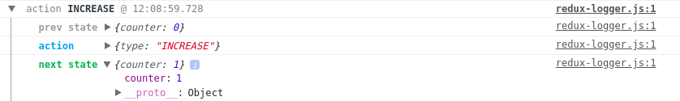
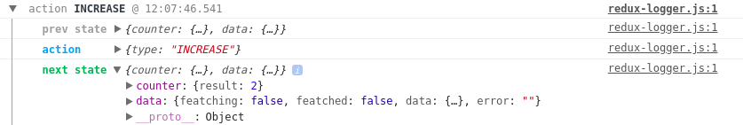

# What is Redux?

Everything you change in your application, including data and UI changes is contained in an object called `state`, so
basically Redux is a store that contains the application state and a few interesting methods.

## State 

`State` is a read-only object contains information about your application.
When you want to modify the state, you need to `dispatch` an `action`.

## Action

Put simply, `action` is a plain JavaScript object including information about changes in the application.
You can send an action to the `store` using `store.dispatch()` method.
Action's minimum requirement is a `type` property. Example below:

```js
{
  type: 'INCREASE',
  payload: action.payload
}
```

## Action creators

`Action creators` are functions which basically return an action object. Example below:

```js
function increase() {
  return {
    type: 'INCREASE',
  }
}
```

## Reducer

`Reducer` specifies how the application `state` changes in regard to a `dispatched action`.
Reducer receives `initial state`, `previous state` and `action`, then returns a new `state` object depending on `action.type`.

Reducer should be `immutable`, so it **doesn't modify** the previous state, just returns a **new state object**.

## Store

`Store` holds the current application `state` object, and has a few useful methods, for example `dispatch` allowing you to `dispatch actions`.
When creating a `store`, you need to provide a `reducer` as a parameter to let the store know what you want to update and how.

```js
const store = createStore(reducer);
```

### Store methods:

`getState` - returns current state

`dispatch` - lets you dispatch actions

`subscribe` - lets you subscribe on store changes and register a callback

### Important tips !

Store shouldn't be mutated!

You should always return a new object.

To avoid object mutations, you can use those methods:

- spread operator:

```js
return {
  ...state,
  counter: state.counter + 1
}
```

- Object.assign method:

```js
return Object.assign({}, state, {
  counter: state.counter + 1
}
```

# Let's do it in practice!

## React installation

For this article I used `createReactApp` starter.

If you want to use it, please go to [Crate React App](https://github.com/facebook/create-react-app),
then following the `createReactApp` manual, you should be able to use these commands:

```
npx create-react-app my-app
cd my-app
npm start
```

Congratulations! Your React application is running.

Now we want to install Redux

## Chapter 1 - Redux installation

```
npm i react-redux redux --save.
```

Redux is installed, so now we can try to create our Redux store.
Please open the react app folder in your IDE, go to `src`.
For this article I removed all unnecessary files.
You can also remove everything from `src` besides index.js.

### Create our first Redux Store

Go to ```index.js```
First of all, we need to import the `createStore` method

```js
import { createStore } from 'redux';
```

To create a store, you need to call `createStore` method, and pass a reducer as an argument

```js
const store = createStore(reducer);
```

Now we need a `reducer`.
In this case it is a simple counter reducer

```js
const reducer = (state = initialState, action) => {
  // Reducer changes state depending on the action.type we are dispatching
  switch (action.type) {
    case 'INCREASE':
      return {
        ...state,
        counter: state.counter + 1
      };
    case 'DECREASE':
      return {
        ...state,
        counter: state.counter - 1
      };
    default:
      return state;
  }
}
```

As you can see, our reducer is using `initialState`.
We can define it like this:

```js
const initialState = {
  counter: 0
}
```

Ok, that's almost it.
Now we want to dispatch an action to change our application state

```js
store.dispatch({
  type: 'INCREASE'
})
store.dispatch({
  type: 'INCREASE'
})
store.dispatch({
  type: 'DECREASE'
})
```

I dispatched 3 actions with 2 different types. As I wrote above, TYPE is required in redux action.

As a last step, we want to watch our changes.
To do it, we need to use the subscribe method.

```js
store.subscribe(() => {
  console.log('Store changed: ', store.getState().counter)
})
```

Great! Now we have a working redux store. Check a console in your browser to see a state changes.
Whole `index.js` file should looks like this

```js
import React, { Component } from 'react';
import ReactDOM from 'react-dom';

import { createStore } from 'redux';

const initialState = {
  counter: 0
}

const reducer = (state = initialState, action) => {
  switch (action.type) {
    case 'INCREASE':
      return {
        ...state,
        counter: state.counter + 1
      };
    case 'DECREASE':
      return {
        ...state,
        counter: state.counter - 1
      };
    default:
      return state;
  }
}

const store = createStore(reducer);

store.subscribe(() => {
  console.log('Store changed: ', store.getState().counter)
})

store.dispatch({
  type: 'INCREASE'
})
store.dispatch({
  type: 'INCREASE'
})
store.dispatch({
  type: 'DECREASE'
})

class App extends Component {

  render() {
    return (
      <h1>Redux in React</h1>
    )
  }
}

ReactDOM.render(<App />, document.getElementById('root'));
```

[Chapter code here](https://bitbucket.org/michalrozenek/redux-tutorial/src/9c69705bf901b0779a55957dd8b3ed3e856e5453/src/?at=lesson-01)

## Chapter 2 - Modify the store from UI

To modify the `store` from the `UI`, we will add some buttons in the `App component`.

```js
class App extends Component {

  render() {
    return (
      <div>
        <button onClick={() => increase()}>
          +
        </button>
  
        <button onClick={() => decrease()}>
        -
        </button>
        <h1>{`Result: ${store.getState().counter}`}</h1>
      </div>
    )
  }
}
```

In our `<App />` component we are using `increase` and `decrease` functions. Let's prepare those functions.

```js
const increase = () => {
  store.dispatch({
    type: 'INCREASE'
  })
}

const decrease = () => {
  store.dispatch({
    type: 'DECREASE'
  })
}
```

Functions above are dispatching actions.

The last thing we need to do is a re-render an `<App />` component when state changes.
In this case we can use the `subscribe` method on `store` object, then as a callback we can use
```
ReactDOM.render() method
```

```js
const rootRender = () => {
  ReactDOM.render(<App />, document.getElementById('root'));
}

store.subscribe(() => {
  rootRender();
})

rootRender();
```

Now you can modify your application state from the `UI`.
Chapter code is [here](https://bitbucket.org/michalrozenek/redux-tutorial/src/4cf6bd490fe5c3f75e6d3fb0d3f0639e369b6d16/src?at=lesson-02)

## Chapter 3 - Redux middleware and logger

Redux allows you to use `middlewares`.
In this chapter we want to use a `logger` middleware.
Later in this article we will also use a `redux-thunk` middleware to handle async functions.

First of all we need to install our logger

```js
npm i redux-logger --save-dev
```

Now we need to import the `applyMiddleware` method

```js
import { createStore, applyMiddleware } from 'redux';
import { createLogger } from 'redux-logger';
```

When the `applyMiddleware` method is available, we can create middleware

```js
const middleware = applyMiddleware(createLogger());
```

The last step we need to do to be able to enjoy a logger is adding it as a second argument of the `createStore` function.

```js
const store = createStore(reducer, middleware);
```

Done!
Your logger should look like this


Chapter code is [here](https://bitbucket.org/michalrozenek/redux-tutorial/src/f30faa2b6b883520c7e62646cf1857ff2ca13c7f/src?at=lesson-03)


## Chapter 4 - Dividing Redux Store to separate files, Connect(), Provider.

In this chapter we are going to clean up our application.
We want to:
- move the Counter to the separate component
- move the reducer and the store to the separate files
- Use a Provider from `react-redux` to pass the store down into the components inside the Provider.
- Use the `connect()` method from `react-redux` to connect the `<Counter />` component with a store.

First of all we want to install the dependencies

```
npm i react-redux --save
```

Now we want to create a Counter component.

```js
import React, { Component } from 'react';

class Counter extends Component {

  render() {
    return (
      <div>
        <button onClick={() => this.props.increase()}>
          +
        </button>
  
        <button onClick={() => this.props.decrease()}>
        -
        </button>
        <h1>{`Result: ${this.props.counter}`}</h1>
      </div>
    )
  }
}

export default Counter;

```

To allow the `Counter` component connect to the store, we need to import the `connect` method

```js
import { connect } from 'react-redux';
```

To allow us to read the state, we need to pass the redux state to the props (`mapStateToProps`), and use the `connect()` method.

```js
const mapStateToProps = state => {
  return {
    counter: state.counter,
  }
}

export default connect(mapStateToProps)(Counter);

```
After that we have the counter state available in `this.props.counter`

Now we want to be able to use a `dispatch` method from `store` inside a `<Counter />` component, so we need to use `mapDispatchToProps`, and pass it as a second argument to the `connect()` method.

```js
const mapDispatchToProps = dispatch => {
  return {
    increase: () => {
      dispatch({
        type: 'INCREASE'
      })
    },

    decrease: () => {
      dispatch({
        type: 'DECREASE'
      })
    }
  }
}

export default connect(mapStateToProps, mapDispatchToProps)(Counter);
```

The whole `<Counter />` component looks like this

```js
import React, { Component } from 'react';
import { connect } from 'react-redux';

class Counter extends Component {

  render() {
    return (
      <div>
        <button onClick={() => this.props.increase()}>
          +
        </button>
  
        <button onClick={() => this.props.decrease()}>
        -
        </button>
        <h1>{`Result: ${this.props.counter}`}</h1>
      </div>
    )
  }
}

const mapStateToProps = state => {
  return {
    counter: state.counter,
  }
}

const mapDispatchToProps = dispatch => {
  return {
    increase: () => {
      dispatch({
        type: 'INCREASE'
      })
    },

    decrease: () => {
      dispatch({
        type: 'DECREASE'
      })
    }
  }
}

export default connect(mapStateToProps, mapDispatchToProps)(Counter);
```

Ok, great! We have a Counter component ready to use.
Now we need to create a `store` and `reducer` by copying them from the main `index.js` file.

We can create a `store` folder and `index.js` file inside it.

```js
import { createStore, applyMiddleware } from 'redux';
import { createLogger } from 'redux-logger';
import counterReducer from './reducer'

const middleware = applyMiddleware(createLogger());

export default createStore(counterReducer, middleware);
```

As you can see above, our `createStore` method needs a reducer.
We can copy the reducer from main `index.js` to the `store/reducer.js` file.

```js
const initialState = {
  counter: 0
}

const counterReducer = (state = initialState, action) => {
  switch (action.type) {
    case 'INCREASE':
      return {
        ...state,
        counter: state.counter + 1
      };
    case 'DECREASE':
      return {
        ...state,
        counter: state.counter - 1
      };
    default:
      return state;
  }
}

export default counterReducer;
```

We moved the `store` and the `reducer` into the `store` folder and `Counter` component into the `Counter.js` file.

Now we want to import the `Provider` and put a Counter inside it
`Provider` makes the `Redux store` available to the `connect()` calls in the component hierarchy below.
We need to pass a store as an argument for a Provider.

After the changes, our main `index.js` should look like this:

```js
import React, { Component } from 'react';
import ReactDOM from 'react-dom';
import { Provider } from 'react-redux';
import store from './store';
import Counter from './Counter';

class App extends Component {
  render() {
    return (
      <Provider store={store}>
        <Counter />
      </Provider>
    )
  }
}

ReactDOM.render(<App />, document.getElementById('root'));
```

Congratulations! We finished this chapter!
Chapter code is [here](https://bitbucket.org/michalrozenek/redux-tutorial/src/573143833d2671f342cb400a47daa2b18a816fb5/src?at=lesson-04)

## Chapter 5 - Multiple reducers using combineReducers method

To combine reducers, we can use `combineReducers` method from `redux` library.
In the next chapter we want to fetch some data, and now we will create a data reducer for this purpose.
At the moment it will be a simple reducer not making any HTTP requests - we will do it later.

We want to create a `reducers` folder inside the `store`, then move and rename the `reducer.js` file to `reducers/counter.js`.
Now we can create a second reducer - `reducers/data.js`

```js
const initialState = {
  fetching: false,
  fetched: false,
  articles: {},
  error: ''
}

const dataReducer = (state = initialState, action) => {
  switch (action.type) {
    case 'DATA_FETCHING':
      return {
        ...state,
        fetching: true
      };
    case 'DATA_FETCHED':
      return {
        ...state,
        fetching: false,
        fetched: true,
        articles: action.payload,
        error: ''
      };
    case 'DATA_ERROR':
      return {
        ...state,
        fetching: false,
        fetched: false,
        error: action.payload
      }
    default:
      return state;
  }
}

export default dataReducer;
```

The next step is to combine those reducers.
I prepared `reducers/index.js` file including the `combineReducers` method.

```js
/// Import combineReducers method and all reducers to combine
import { combineReducers } from 'redux';
import counterReducer from './counter';
import dataReducer from './data';

// Use combineReducers method
const reducer = combineReducers({
  counter: counterReducer,
  data: dataReducer
});

// Export combined reducers
export default reducer;
```
Last step we need to do is naming changes in `store/index.js` file

```js
import reducer from './reducers'
```

```js
export default createStore(reducer, middleware);
```

Now our state structure changed

State before:


State after:


Our simple state changed, so we need to modify the `counter reducer` and `<Counter />` component a little bit.

In `reducers/counter.js` file change `counter` to `result` for better naming:

```js
const initialState = {
  result: 0
}
```

```js
return {
  ...state,
  result: state.result + 1
};
```

In `Counter.js` we have `this.props.counter` as an object now, so if we want to render the `result` value, we need to modify our code to:

```js
  <h1>{`Result: ${this.props.counter.result}`}</h1>
```

Chapter code is [here](https://bitbucket.org/michalrozenek/redux-tutorial/src/ee7af501f898a8dd8cba05b9372b79b093ee3c15/src?at=lesson-05)

## Chapter 6 - Fetching data with Redux, redux-thunk middleware, and Axios

To `dispatch asynchronous actions` you will need `redux-thunk`, which
basically is a function that wraps an expression to delay its evaluation.

```
npm install --save redux-thunk
```

Go to `store/index.js` and import redux-thunk

```js
import thunk from 'redux-thunk';
```

then modify the middleware

```js
const middleware = applyMiddleware(createLogger(), thunk);
```

Ok! Thunk middleware is implemented.

For fetching data I chose `axios` - Promise based HTTP client for the browser and node.js

```
npm install --save axios
```

In this chapter I want to:

- Move `types` to separate file
- Move `actions` to separate file
- Update `reducers/data.js`

When your applications grows, the good practice is to store types in separate file as a constants.
To do this operation please open the `store` directory and create a `types/index.js` file.

I prepared 3 constatns for use in reducer and actions.

```js
export const DATA_FETCHING = 'DATA_FETCHING';
export const DATA_FETCHED = 'DATA_FETCHED';
export const DATA_ERROR = 'DATA_ERROR';
```

Now we can update `reducers/data.js` using variables instead of strings.

```js
import { DATA_FETCHING, DATA_FETCHED, DATA_ERROR } from '../types';
```

```
case DATA_FETCHING
```

instead of

```
case 'DATA_FETCHING'
```

### How to prepare an action for data fetching

Create an action directory and dataAction.js `action/dataAction.js`
Import axios and types we want to use.

```js
  import axios from 'axios';
  import { DATA_FETCHING, DATA_FETCHED, DATA_ERROR } from '../types'
```

Then we can create the first `action`.
While `fetching` the data we want to modify some UI elements, therefore we want to know when the application started the operation.

```js
export const fetchData = () => {
  return dispatch => {
    dispatch({
      type: DATA_FETCHING,
    })
  }
};
```

We've just updated the application state.
Now we can add some data fetching code inside the `fetchData` action.

```js
return axios.get('https://jsonplaceholder.typicode.com/posts') // Example API here
  .then((res) => {
    if (res.status === 200) {
      // Here is fetching success. We can pass a res.data as a payload value
      dispatch({
        type: DATA_FETCHED,
        payload: res.data
      })
    }
  })
  .catch((error) => {
    // If we catch some error, we could dispatch an error
    dispatch({
      type: DATA_ERROR,
      payload: error.response.data
    })
  })
```

Whole `dataAction.js` looks like this

```js
import axios from 'axios';
import { DATA_FETCHING, DATA_FETCHED, DATA_ERROR } from '../types'

export const fetchData = () => {
  return dispatch => {
    dispatch({
      type: DATA_FETCHING,
    })

    return axios.get('https://jsonplaceholder.typicode.com/posts')
    .then((res) => {
      if (res.status === 200) {
        dispatch({
          type: DATA_FETCHED,
          payload: res.data
        })
      }
    })
    .catch((error) => {
      dispatch({
        type: DATA_ERROR,
        payload: error.response.data
      })
    })
  }
};
```

Invoking the action above will update the `state.data`.
Your data reducer is responsible for state.data output.

We are ready to use actions. Now we can implement them in a Component.
There are many ways to do it.

You can invoke the fetchData action in the `componentDidMount` lifecycle method, or maybe in the `onClick` method.

For this article I prepared a simple `<Data />` component.

```js
import React, { Component } from 'react';

class Data extends Component {

  render() {
    // Create articles constants for fetched articles data using ES6 destructuring
    const { articles } = this.props.data;

    return (
      <div>
        { /* Fetching data action invokes by clicking a button */ }
        <button onClick={() => this.props.fetchData()}>
          Fetch data
        </button>
        <ul>
        { articles &&
          // Map method on fetched articles
          Object.keys(articles).map((item) => {
            return (
              // Render li elements
              <li key={articles[item].id}>
                {articles[item].title}
              </li>
            )
          })
        }
        </ul>
      </div>
    )
  }
}
```

Then I imported `connect` and `fetchData` action.

```js
import { connect } from 'react-redux';
import { fetchData } from './store/actions/dataAction';
```

Finally I passed the state and dispatch actions to props, and connected it to our store.

```js
const mapStateToProps = state => {
  return {
    data: state.data,
  }
}

const mapDispatchToProps = dispatch => {
  return {
    fetchData: () => {
      dispatch(fetchData())
    }
  }
}

export default connect(mapStateToProps, mapDispatchToProps)(Data);
```

The last thing to do is to render the `<Data />` component.
Go to the main `index.js` file, import the `Data` component and put in the `render()` method.

```js
<Provider store={store}>
  <div>
    <Counter />
    <Data />
  </div>
</Provider>
```

This is it!
We have data fetching handled with Redux and redux-thunk.


Code [here](https://bitbucket.org/michalrozenek/redux-tutorial/src/aaa5e6bf7548ea50fb6448100216b6a2840f10b8/src?at=lesson-07)