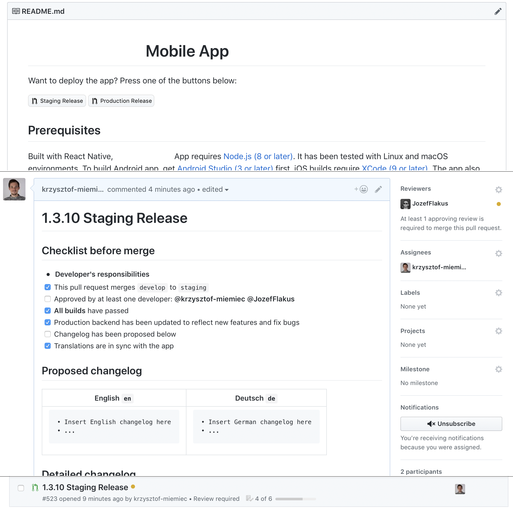

- [Pull Request Templates](#pr-templates)
- [How does it help us](#how-does-it-help-us)
- [Let's do this together](#lets-do-this-together)

## <a name="pr-templates"></a>Pull Request Templates

*Have you ever used `PULL_REQUEST_TEMPLATE.md`?* If not, I really recommend you to start doing it. After adding such file to your repository, GitHub (or any other repository management service) will start adding that markdown file as a content of your Pull Requests. You can add a "before-merge checklist" of things that can't be automatically checked by CI or can be easily forgotten. A strict template structure also helps the others to quickly skim through the contents of PR description.

## <a name="how-does-it-help-us"></a>How does it help us

Recently we had a minor problem, because I forgot to check if the app has correct, up-to-date translations before the release. We have a fully automatic deployment pipeline, in which PR merge to `master` branch equals production deployment. So yes, we had a production release without some basic checks. To prevent this kind of f**-ups in the future, I decided to create separate PR templates, designed specifically for staging and production builds.

## <a name="lets-do-this-together"></a>Let's do this together

You can place a single `PULL_REQUEST_TEMPLATE.md` in one of the following locations to define a default template for all PRs:
* `PULL_REQUEST_TEMPLATE.md` in repository's root
* `.github/PULL_REQUEST_TEMPLATE.md`
* `docs/PULL_REQUEST_TEMPLATE.md`

Our basic `PULL_REQUEST_TEMPLATE.md` looks like this:

````markdown
## PR Type
What kind of change does this PR introduce?
```
[ ] Bugfix
[ ] Feature
[ ] Code style update (formatting, local variables)
[ ] Refactoring (no functional changes, no api changes)
[ ] Build related changes
[ ] CI related changes
[ ] Documentation content changes
[ ] Tests
[ ] Other
```
[Jira Link](https://xsolve.atlassian.net/browse/PROJECT_KEY)

## What's new?
-

## Screenshots
N/A
````

GitHub automatically detects multiple PR templates stored in `.github/PULL_REQUEST_TEMPLATE` in your repository's main branch, but their names have to be passed to the URL. 

First, the template for `staging` to `master` pull request, located in `.github/PULL_REQUEST_TEMPLATE/master.md`:

````markdown
# 1.x.x Production Release

## Checklist before merge
* **Developer's responsibilities**
* [ ] This pull request merges `staging` to `master`
* [ ] The source commit is tagged with version number
* [ ] Translations are in sync with the app
* [ ] Approved by at least one developer: @krzysztof-miemiec 
* [ ] **Pull request build** has passed
* [ ] Staging app has been deployed successfully (sometimes iOS build fails despite successful deployment)
* [ ] Production backend has been updated to reflect new features and fix bugs
* [ ] Changelog has been proposed below
* **Product Owner's responsibilities**
* [ ] No issues have been found on staging environment
* [ ] Product Owner has approved the release
* [ ] Final changelog has been determined/approved
* [ ] Final changelog has at most **500 characters**

## Proposed changelog

<table>
<tr><th>English <code>en</code></th><th>Deutsch <code>de</code></th><tr>
<tr><td><pre>
• Insert English changelog here
• ...
</pre></td><td><pre>
• Insert German changelog here
• ...
</pre></td></tr></table>

## Detailed changelog
Changes since last production release.
````

In our case, the link to quickly create such PR is 
```
https://github.com/xsolve-pl/project-name/compare/master...staging?expand=1&template=master.md
```

There is no point in creating a template without an easy access to it. Hence, I placed small buttons in the top of our `README.md`:

```markdown
Want to deploy the app? Press one of the buttons below:

<a href="https://github.com/xsolve-pl/project-name/compare/staging...develop?expand=1&template=staging.md"></a>
<a href="https://github.com/xsolve-pl/project-name/compare/master...staging?expand=1&template=master.md"></a>

```

The result looks like this:

>
>Want to deploy the app? Press one of the buttons below:
>
><a href="https://github.com/xsolve-pl/project-name/compare/staging...develop?expand=1&template=staging.md"></a>
> <a href="https://github.com/xsolve-pl/project-name/compare/master...staging?expand=1&template=master.md"></a>
>

There is no easier way that I'm aware of - just a simple press of a button to create a release PR.

Additional benefit of having a checklist is that we can track status of the progress on our release.


