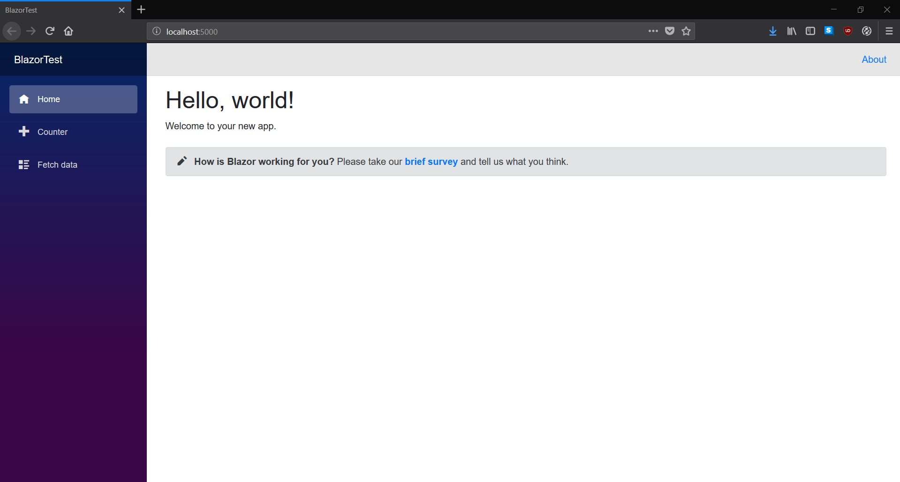
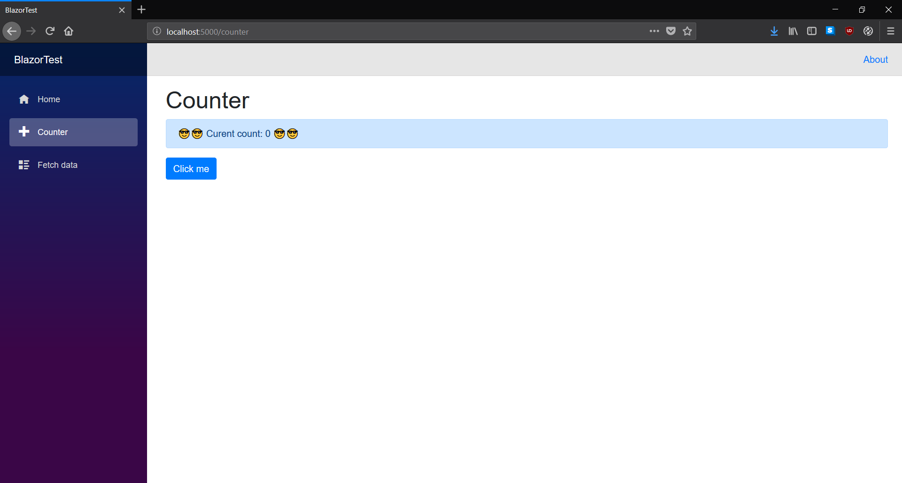

# Introduction

.NET ecosystem has seen some rapid changes in the recent times. With advent of [.NET Core](https://dot.net/core), the official cross-platform implenetation of the runtime (and SDK) Linux and Mac users have gained a way to write and run .NET code in the comfort of their favourite OSes, all supported and ratified by Microsoft. The new and shiny tooling as well as ASP.NET Core's impressive performance (in top 10 of TechEmpower's [Fortunes benchmark](https://www.techempower.com/benchmarks/#section=data-r16&hw=ph&test=fortune)) have overshadowed .NET Core's older x-plat sibling, the Mono runtime. But it is one of Mono's targets that interests us today - namely WebAssembly. Ladies and gentlemen, allow me to introduce...

# Blazor
**An experimental .NET web framework using C#/Razor and HTML that runs in the browser via WebAssembly**

...but not exclusively, more on that later.

## Getting started

Disclaimer: this article assumes at least some familiarity with .NET, Razor, C# and web technologies.

Another disclaimer: as stated above, Blazor is an experimental piece of technology and as such everything about it can change, so the contents of this article might not reflect the current state 1:1.

You will need [.NET Core SDK](https://dot.net/core) v2.1.402 or above.

And then, depending on your editor of choice grab
[Blazor Languge Services Extension](https://go.microsoft.com/fwlink/?linkid=870389) for Visual Studio 2017 v15.8 or above. Note: you will need _ASP.NET and web development_ workload installed.

Alternatively, for VS Code users out there there's [Razor+](https://marketplace.visualstudio.com/items?itemName=austincummings.razor-plus) extension. To create projects using the CLI, run the following command:

`dotnet new -i Microsoft.AspNetCore.Blazor.Templates`

Admittedly, I recommend going the Visual Studio way because the tooling is objectively better and regularly updated.

## Creating a new project

For Visual Studio users out there, simply create a new ASP.NET Core project and select one of three Blazor options presented in the dialog. And what options they are!

* Blazor (standalone) - for all intents and purposes a static website, uses Mono on WASM to execute your code. The CLI command to create a project is `dotnet new blazor`. Since no server code is required whatsoever, you can host it like you would any static website, including Github/Gitlab pages!
* Blazor (ASP.NET Core hosted) - pretty similar to the standalone version but with an ASP.NET Core backend. CLI commmand: `dotnet new blazorhosted`.
* Blazor (server-side in ASP.NET Core) - all code is run by the server with DOM updates transmitted using SignalR connection. Since this is pure ASP.NET Core, you will enjoy full debugger support and, if all goes well, an official release with .NET Core 3 under a name *Razor Components*. CLI command: `dotnet new blazorserverside`

I mention full debugger support for server-side Blazor - that's because for the other two options the debugging experience is currently extremely limited and can be done exclusively using Google Chrome. See [the docs](https://blazor.net/docs/debugging.html) for details.

## First run

Let's create a new _standalone_ project. Once that's done, you can launch it by either using `ctrl + F5` in Visual Studio or `dotnet run` CLI command. Either way, you will know all went well if the following appears in your browser:



Should the app fail to run, it is worth checking if there are conflicting .NET Core runtime versions. Uninstalling the old ones should help.

As of now, there's no live reload support. If you're using Visual Studio, then app should rebuild automagically when you refresh the page and changes are detected. For CLI users, you will need to add 

`<Watch Include="**\*.cshtml" />`

under `<ItemGroup>` tag in your project's .csproj file and run the app using `dotnet watch run` command.

## Components

### Pages

In Blazor, everything is a component, be it a layout, a page or, well, a component. Let's inspect _Counter.cshtml_ sitting in _Pages_ folder. The code should look similar to this:

```cs
@page "/counter"

<h1>Counter</h1>

<p>Current count: @currentCount</p>

<button class="btn btn-primary" onclick="@IncrementCount">Click me</button>

@functions {
    int currentCount = 0;

    void IncrementCount()
    {
        currentCount++;
    }
}

```

The code should be familiar to anyone who had worked with Razor before which should not be a surprise, given that `Blazor = browser + Razor`. Click the button and you'll see the counter increment just as you would expect, given the C# code above. Yes, C#!

Let's deconstruct the code piece by piece.

`@page "/counter"` directive tells Blazor that this component is a page and can be routed to.

`<h1>Counter</h1>` is good ol' plain HTML, no surprises here, unless you're easily startled by headers or XML tags in general.

`<p>Current count: @currentCount</p>` is where the interesting stuff begins. The `@currentCount` is a reference to the field defined in the `@functions` block below and will cause the current value in the variable to be rendered there.

`<button class="btn btn-primary" onclick="@IncrementCount">Click me</button>` is where we see the onclick event handler which is also a reference to the `IncrementCount()` method below. More on event handling later.

Finally, there's the `@functions` block where we define our variables, parameters, functions, etc.

### Routing

One page can have multiple routes assigned to it and routes can have parameters. Let's modify the code to allow a route which would set an initial value to the counter:

```cs
@page "/counter"
@page "/counter/{CurrentCount:int}"

<h1>Counter</h1>

<p>Current count: @CurrentCount</p>

<button class="btn btn-primary" onclick="@IncrementCount">Click me</button>

@functions {
    [Parameter] int CurrentCount { get; set; } = 0;

    void IncrementCount()
    {
        CurrentCount++;
    }
}
```

We've added an additional route with parameter constrained to `int` type, changed `currentCount` field to a property (properly PascalCased) and decorated it with `[Parameter]` attribute which allows us to navigate to `http://localhost:5000/counter/3` (adjust the port if needed but 5000 is the default for `dotnet run`) and we should see that the counter is initialized with 3. Neat!

### Separate markup and code

At this point you might be thinking "But do I _have to_ have everything in one file?" and short answer to that is `no`. The long answer is that we can make use of `@inherits` directive and extract the logic to a separate class which our component would inhertit from. The "code behind" class must inherit `BlazorComponent` for that to work:

```cs
abstract class CounterComponent : BlazorComponent
{
    [Parameter] protected int CurrentCount { get; set; } = 0;

    protected void IncrementCount()
    {
        CurrentCount++;
    }
}
```

together with

```html
@inherits CounterComponent
@page "/counter"
@page "/counter/{CurrentCount:int}"

<h1>Counter</h1>

<p>Current count: @CurrentCount</p>

<button class="btn btn-primary" onclick="@IncrementCount">Click me</button>
```

will result in the same thing but split in twain.

### Layouts

As most frameworks do, Blazor allows components to use layouts to reduce code repetition. A brief look at _MainLayout.cshtml_ file in _Shared_ folder will reveal that to create a layout we need to:
* Inherit from `BlazorLayoutComponent`.
* Render the body using `@Body` somewhere in the layout's markup.

In _Pages_ folder there's a file called __ViewImports.cshtml_ which is a reserved name meaning something along the lines of "add the content of this file to all page components that are siblings of this file or in child folders". Inside, there's one line `@layout MainLayout` that controls which component is to be used as the layout. Each component can override this by using the same syntax or refuse the layout at all by using `@layout null`.

### Regular components

Obviously, not every component needs to be a routable page, but a reusable piece instead. The way we define those is almost identical to pages sans the `@page` directive. Even though the cool factor of this framework is already pretty high, let's have it go through the roof by adding a new file _CoolCounter.cshtml_ in _Shared_ folder. Once we have it, let's write some code:

```cs
<div class="alert alert-primary">
    @ChildContent
    Curent count: @Count
    @ChildContent
</div>

@functions {
    [Parameter] int Count { get; set; }
    [Parameter] RenderFragment ChildContent { get; set; }
}
```

In _Counter.cshtml_ let's change

`<p>Current count: @CurrentCount</p>`

to

`<CoolCounter Count="CurrentCount">😎</CoolCounter>`

After reloading the counter page you should see something like this:



Let's dissect the code. Using components is as simple as writing a tag with its name, `CoolComponent` being the case here. The `ChildContent` property is a reserved name for, as the name suggests, child content that you can put in the component. In the example above our child content is a smiling face with sunglasses emoji rendered twice with `@ChildContent` to ensure maximum coolness.

A familiar `[Parameter]` attribute has made a reappearance but means something different for a non-page component. We can use it to pass parameters in the markup, `Count="CurrentCount"` being the syntax in the tag here. What other things can be passed as parameters? Sky is the limit. Say that we want to add some extensibility to the `CoolComponent` and have it somehow react to click event. Easy peasy, just add the following line in the `@functions` block:

`[Parameter] Action Click { get; set; }`

and also add the `onclick` handler to the div element:

`<div class="alert alert-primary" onclick="@(() => Click?.Invoke())">`

Finally, we need to pass some action as a parameter where we invoke our component:

`<CoolCounter Count="CurrentCount" Click="() => CurrentCount = 0">😎</CoolCounter>`

This handler could, of course, be extracted to a separate method but inline lambda expressions are acceptable as well. So let's reload the counter page, increment it a bit, click the component and... Nothing. That's because the action wasn't directly called in a DOM event handler. We need to give the framework a small nudge. Let's change our component invocation a bit:

`<CoolCounter Count="CurrentCount" Click="() => { CurrentCount = 0; StateHasChanged(); }">😎</CoolCounter>`

By calling the `StateHasChanged()` method we inform Blazor that something has happened outside the area it keeps under watch and that the document tree needs to be updated. The example also shows the point at which we could start seriously considering dropping the lambda in favour of a separate method.

### Templated components

Components are reusable by themselves but there is a way to make them even more universal and that is to have them accept templates. Let's have a look at _FetchData.cshtml_ in _Pages_ folder. It's a page component demoing the use of HttpClient provided by DI and `@inject` directive and displaying the weather data fetched with it. The table where the data is shown is perfectly fine but we can make it reusable by extracting it to a separate component. Let's do just that - create a new _TemplatedTable.cshtml_ file in _Shared_ folder and add the following code inside:
```cs
@typeparam T

<table class="table">
    <thead>
        <tr>@Header</tr>
    </thead>
    <tbody>
        @foreach (var item in Items)
        {
            <tr>@Row(item)</tr>
        }
    </tbody>
</table>

@functions {
    [Parameter] RenderFragment Header { get; set; }
    [Parameter] RenderFragment<T> Row { get; set; }
    [Parameter] IEnumerable<T> Items { get; set; }
}
```

The `@typeparam` directive makes the component a generic class and allows it to accept any type of item which is vital for list-type scenarios. Unfortunately, there's no way to put type constraints on the generics as of now.

With that ready, we can throw out most of the table code from _FetchData.cshtml_ and replace it with the following:

```cs
<TemplatedTable Items="forecasts">
    <Header>
        <th>Date</th>
        <th>Temp. (C)</th>
        <th>Temp. (F)</th>
        <th>Summary</th>
    </Header>
    <Row Context="forecast">
        <td>@forecast.Date.ToShortDateString()</td>
        <td>@forecast.TemperatureC</td>
        <td>@forecast.TemperatureF</td>
        <td>@forecast.Summary</td>
    </Row>
</TemplatedTable>
```

After reloading the fetch data page, we will see exactly the same thing but what's important is that we did it the templated way.

## Final excercise

Nearing the end, let's add an entirely new page and have it display an old-fashioned clock with hands. So, in the _Pages_ folder let's add a new _Clock.cshtml_ file with the following content:
```cs
@page "/clock"
@using System.Threading

<h1>Clock</h1>
<div class="clock">
    <div style="@GetHandStyle(d => d.Second, 6)" class="second hand"></div>
    <div style="@GetHandStyle(d => d.Minute + d.Second / 60.0, 6)" class="minute hand"></div>
    <div style="@GetHandStyle(d => d.Hour % 12 + d.Minute / 60.0 + d.Second / 3600.0, 30)" class="hour hand"></div>
</div>
<div>@currentTime.ToString("s")</div>

@functions {
    DateTime currentTime = DateTime.Now;
    Timer clockTimer = null;

    protected override void OnInit()
    {
        clockTimer = new Timer(_ =>{
            currentTime = DateTime.Now;
            StateHasChanged();
        }, null, 0, 1000);
    }

    string GetHandStyle(Func<DateTime, double> unitSelector, int multiplier) =>
        $"transform: rotateZ({unitSelector(currentTime) * multiplier + 180}deg);";
}
```

We will also need to add some CSS to _site.css_ file sitting in _wwwroot/css_ folder:
```css
.clock {
    height: 300px;
    width: 300px;
    border-radius: 50%;
    border: 2px solid black;
    position: relative;
}

.hand {
    width: 2px;
    position: absolute;
    left: 50%;
    top: 50%;
    transform-origin: 0 0;
}

.hour {
    height: 75px;
    background-color: black;
}

.minute {
    height: 100px;
    background-color: gray;
}

.second {
    height: 125px;
    background-color: red;
}
```

But given that we cannot have users need to guess the URL of every page in our app, let's also expand the navigation in _NavMenu.cshtml_ in _Shared_ folder with a new item:
```cs
<li class="nav-item px-3">
    <NavLink class="nav-link" href="clock">
        <span class="oi oi-list-rich" aria-hidden="true"></span> Clock
    </NavLink>
</li>
```

`NavLink` is Blazor's built-in component which renders as an anchor element but adds `.active` class when you navigate to a page in the `href` parameter.

Ok, but what has just happened? Well, we've built a half-decent clock using Blazor and a smidge of CSS. By using `void OnInit()` override, we could hook into the component's lifecycle and initialize the timer that is set to tick every second and update the `currentTime` field. Because it's not happening as an effect of some DOM event, we need to notify of changes using `StateHasChanged()` method. But wait, the time's wrong. At least if you are not living in the UTC timezone area, that is. That's another limitation of the experimental state of Blazor - the current locale are not being pulled from the browser, so the framework doesn't know what timezone the user is in. This is to be amended in some future release.

## Wrap up

I hope that you've found this article informative and maybe, just maybe, you will give this amazing piece of tech a go. For any further reading, I recommend visiting the [Blazor website](https://blazor.net) and their [GitHub repo](https://github.com/aspnet/blazor), the best source of Blazor info.

That's it! Thanks for reading and happy hacking.